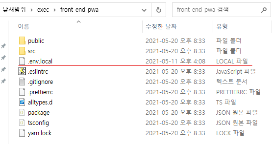
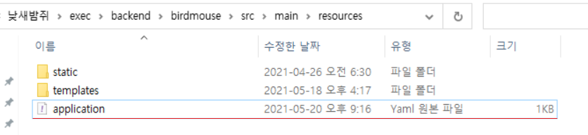
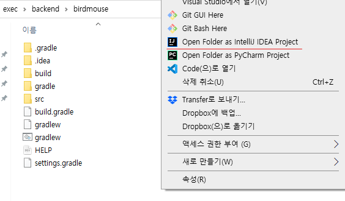
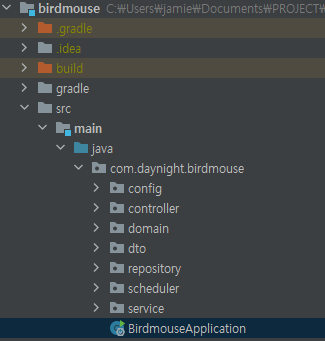

# 프로젝트 세팅 매뉴얼

[사전에 필수로 설치해야하는 것들]

- Java 11
- IntelliJ (STS는 Java 11 관련 직접 설정해줘야하는 항목이 너무 많기 때문에 IntelliJ로 백엔드 환경 실행을 권장합니다.)
- Docker
- Redis
- Node.js 14+

<br>

## 설치 방법

각 필수 프로그램 설치 안내는 잘 설명된 링크들로 대체했습니다. 참고 후 설치 부탁드립니다.

#### Java 11

- [윈도우 10 환경에 Java SE 11 설치하기 (출처: 티스토리 꿈을 향하여 질주하기)](https://sparkdia.tistory.com/64#:~:text=1.%20JDK%20%EC%84%A4%EC%B9%98%20%ED%94%84%EB%A1%9C%EA%B7%B8%EB%9E%A8%20%EB%8B%A4%EC%9A%B4%EB%A1%9C%EB%93%9C&text=%EB%8B%A4%EC%9A%B4%EB%A1%9C%EB%93%9C%20%EC%9B%B9%20%ED%8E%98%EC%9D%B4%EC%A7%80%20%EC%A4%91%EA%B0%84%20Java,Download'%20%EB%B2%84%ED%8A%BC%EC%9D%84%20%ED%81%B4%EB%A6%AD%ED%95%A9%EB%8B%88%EB%8B%A4.)

#### IntelliJ

- [인텔리제이 커뮤니티 버전 설치하기 (출처: 티스토리 양햄찌가 만드는 세상)](https://jhnyang.tistory.com/418)

#### Docker Desktop

- [윈도우 10 환경에 도커 설치하기 (출처: 티스토리 갓대희의 작은 공간)](https://goddaehee.tistory.com/251)

#### Redis

- `cmd`를 연다
- `docker pull redis` 입력
- `docker run --name nsbj-redis -d -p 6379:6379 redis` 입력
- `docker ps` 입력 후 돌아가고 있는지 확인
  - OR 도커 데스크탑을 열고 nsbj-redis의 start 버튼 누르기

#### Node.js

- https://nodejs.org/ko/download/ 에 접속
- `LTS` 설치
- 설치 후 cmd에서 `node -v`로 버전 확인 (14 이상 필요)

<br>

## 프로젝트 실행

#### [공통]

1. 낮새밤쥐 repo를 clone한다

```bash
$ git clone https://lab.ssafy.com/s04-final/s04p31a406.git
```

2. 레디스를 실행한다
   - `Docker Desktop`이나 `cmd` 를 이용해서 `nsbj-redis`를 실행한다

#### [프론트]

1. [env.local](https://drive.google.com/file/d/18iEYvhGSFicEU1zAGCMDQNcxDQL3HihP/view?usp=sharing)을 다운 받는다

2. 프론트엔드 프로젝트 폴더 아래에 다운받은 파일을 넣는다



3. 프론트엔드 프로젝트가 있는 위치에서 NPM 패키지를 설치한다

```bash
$ yarn install
```

4. 프론트 환경을 실행한다

```bash
$ yarn serve
```

#### [백엔드]

1. [application.properties](https://drive.google.com/file/d/1yylAyN_huFr1B8wVRF7urgl0eZYjEfJB/view?usp=sharing)를 다운받는다

2. 백엔드 프로젝트 폴더의 `exec > backend > birdmouse > src > main > resources`에 다운받은 파일을 넣는다



3. 백엔드 프로젝트가 있는 위치에서 IntelliJ를 연다



4. 프로젝트가 빌드 된 후 메인 애플리케이션을 실행한다




